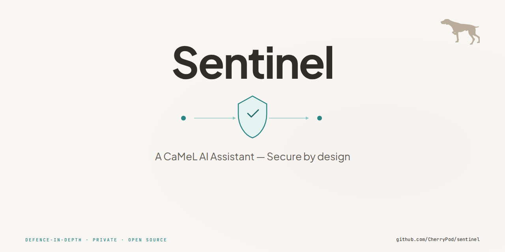

<p align="center">
  
</p>

# Sentinel

A defence-in-depth AI assistant built on the [CaMeL architecture](https://arxiv.org/abs/2503.18813). A frontier model (Claude) plans tasks, an air-gapped local LLM (Qwen) executes them, and a Python security gateway enforces 10 layers of scanning between every step. The worker LLM is assumed compromised at all times — it only receives text and returns text, and every output is scanned before the system acts on it.

## What Makes This Different

- **Air-gapped worker** — the local LLM has zero network access. It cannot phone home, exfiltrate data, or fetch remote payloads
- **10-layer security pipeline** — deterministic policy engine, spotlighting, Prompt Guard, CodeShield, command pattern scanner, encoding scanner, conversation analysis, vulnerability echo detection, ASCII prompt gate, and CaMeL provenance tracking
- **Tiered trust model** — the worker starts with zero trust (text in/out only). Capabilities unlock incrementally after red team passes at each level
- **Human approval gates** — every plan is shown to the user before execution. No autonomous action without consent
- **CaMeL provenance** — every data item is tagged with its source and trust level. Untrusted data cannot reach dangerous operations without scanning and approval

## Architecture

```
+-----------------------------------------------------------------+
|                    sentinel (Python/FastAPI)                     |
|                  HTTPS :8443 / HTTP :8080                       |
|                                                                 |
|  Static UI (/)  |  REST API (/api/*)  |  WebSocket (/ws)       |
|  SSE (/api/events)  |  MCP server (/mcp/)                      |
|                                                                 |
|  POST /task  -->  Input validation  -->  Conversation analysis  |
|              -->  Prompt Guard scan -->  Claude plans            |
|              -->  Human approval    -->  Per-step execution:     |
|                                                                 |
|     llm_task:  prompt gate -> Qwen -> CodeShield -> scan        |
|     tool_call: policy check -> execute -> tag provenance        |
|                                                                 |
|  10 security layers  |  Policy engine  |  Provenance store      |
|  Memory (SQLite+vec) |  Event bus      |  Channel router        |
+-----------------------------+-----------------------------------+
                              | sentinel_internal (air-gapped)
+-----------------------------v-----------------------------------+
|              sentinel-ollama (Ollama, GPU)                       |
|                                                                 |
|     Qwen 3 14B Q4_K_M -- text in, text out (GPU)               |
|     nomic-embed-text -- embeddings for memory search (CPU)      |
|     No internet  |  No tools  |  No file access                 |
+-----------------------------------------------------------------+
```

| Component | Role | Trust Level | Network |
|-----------|------|-------------|---------|
| Claude API (Anthropic) | Privileged planner | Trusted | Internet (via sentinel) |
| Qwen 3 14B (Ollama) | Quarantined worker | **Never trusted** | Air-gapped only |
| Sentinel (FastAPI) | Security gateway + UI + channels | Deterministic | Both networks |

## Security Model

Sentinel assumes the worker LLM is adversarial. Every output passes through a 10-layer scan pipeline before the system acts on it:

| # | Layer | Type | What It Catches |
|---|-------|------|-----------------|
| 1 | PIN Authentication | ASGI middleware | Unauthenticated API access |
| 2 | Policy Engine | Deterministic YAML | File paths, commands, credentials, network |
| 3 | Spotlighting | String manipulation | Prompt injection (dynamic markers, sandwich defence) |
| 4 | Prompt Guard 2 | 86M BERT classifier | Injection detection |
| 5 | CodeShield | Semgrep static analysis | Malicious code patterns |
| 6 | CommandPatternScanner | Regex patterns | Dangerous shell patterns in prose |
| 7 | ConversationAnalyzer | Multi-turn heuristics | Memory poisoning, escalation, context building |
| 8 | VulnerabilityEchoScanner | Input/output fingerprinting | Code injection via "review this" framing |
| 9 | ASCII Prompt Gate | Regex allowlist | Cross-model bilingual injection |
| 10 | CaMeL Provenance | Data tagging | Untrusted data reaching dangerous operations |

For details, see [docs/security-model.md](docs/security-model.md).

## Benchmark Results

**Stress test v3** — 1,136 prompts (314 genuine + 788 adversarial + 34 benchmark), 21+ adversarial attack categories:

| Metric | Result |
|--------|--------|
| Real risk rate | **0.12%** (1/811 adversarial prompts) |
| Raw escape rate | 25.8% (209/811) |
| After triage | 70% planner-defused, 22% benign, 5% educational |
| Genuine pass rate | 79.7% |

The raw escape rate is misleading — most "escapes" are cases where Claude or Qwen refused the adversarial request. After manual triage, only 1 prompt out of 811 adversarial produced genuinely dangerous output.

Full benchmark data and analysis scripts are in [`benchmarks/`](benchmarks/). Assessment reports are in [`docs/assessments/`](docs/assessments/).

## Quick Start

### Prerequisites

- [Podman](https://podman.io/) (rootless) + podman-compose
- NVIDIA GPU with 12GB+ VRAM (for Qwen 3 14B)
- [NVIDIA Container Toolkit](https://docs.nvidia.com/datacenter/cloud-native/container-toolkit/latest/install-guide.html) with CDI configured
- Anthropic API key (for Claude planner)
- HuggingFace token (for Prompt Guard model download during build — [get one here](https://huggingface.co/settings/tokens))

### 1. Clone and create secrets

```bash
git clone https://github.com/CherryPod/sentinel.git
cd sentinel

# Create the secrets directory (gitignored)
mkdir -p secrets

# Required: Anthropic API key for the Claude planner
echo "sk-ant-your-key-here" > secrets/claude_api_key.txt
chmod 600 secrets/claude_api_key.txt
```

### 2. Optional: Set a PIN

PIN authentication is optional. Without a PIN file, the UI works with no authentication — fine for local development.

```bash
# Optional: set a 4-digit PIN to protect the UI
echo "1234" > secrets/sentinel_pin.txt
chmod 600 secrets/sentinel_pin.txt
```

### 3. Build the sentinel image

The build downloads the Prompt Guard model from HuggingFace, which requires an access token passed as a build secret.

```bash
# Store your HuggingFace token somewhere outside the repo
echo "hf_your-token-here" > /tmp/hf_token.txt

# Build (takes a few minutes — installs PyTorch, transformers, downloads Prompt Guard)
podman build \
  --secret id=hf_token,src=/tmp/hf_token.txt \
  -t sentinel \
  -f container/Containerfile .

# Tag with the compose name (podman-compose looks for this)
podman tag sentinel sentinel_sentinel

# Clean up the token
rm /tmp/hf_token.txt
```

### 4. Start the stack

```bash
podman compose up -d
```

This starts two containers:
- **sentinel** — the security gateway, API, and UI (ports 3001 HTTPS, 3002 HTTP)
- **sentinel-ollama** — air-gapped Ollama instance with GPU access

### 5. Download the Qwen model

On first run, the Ollama container has no models loaded. Pull Qwen 3 14B:

```bash
podman exec sentinel-ollama ollama pull qwen3:14b
```

This downloads ~8GB and takes a few minutes. The model is stored in a persistent volume, so you only need to do this once.

### 6. Open the UI

Go to **https://localhost:3001** in your browser.

- Accept the self-signed certificate warning (Advanced → Accept the Risk)
- If you set a PIN in step 2, you'll see a PIN prompt — enter it
- If you skipped the PIN, the UI loads directly
- Type a task and hit Send — Claude will plan it, you approve, Qwen executes

### Verify the stack

```bash
# Health check (should return JSON with all subsystems loaded)
curl -sk https://localhost:3001/health | python3 -m json.tool

# Full smoke test
bash scripts/smoke_test.sh
```

## Using the UI

- **Send a task** — type in the input box and press Enter or click Send
- **Approve/deny plans** — Claude's plan is shown with expandable step details. Click a step to see the full prompt that Qwen will receive. Approve or deny the plan
- **Clear history** — **Shift+click** the "Sentinel" title in the header to clear conversation history. History is stored in your browser's localStorage only — it never leaves your machine
- **Transport** — the UI automatically connects via WebSocket for real-time updates, falling back to HTTP polling if WebSocket isn't available
- **Multiple tabs** — each tab gets its own session (stored in sessionStorage, cleared on tab close)

## Project Structure

```
sentinel/
├── README.md                   This file
├── LICENSE                     Apache-2.0
├── CONTRIBUTING.md             Contributor guide
├── SECURITY.md                 Vulnerability reporting
├── pyproject.toml              Python package config
├── podman-compose.yaml         2-container deployment
│
├── sentinel/                   Python package (security gateway + orchestrator)
│   ├── core/                   Config, database, event bus, models
│   ├── security/               Scanners, policy engine, pipeline
│   ├── planner/                Claude planner, orchestrator, trust router
│   ├── worker/                 Ollama/Qwen client, provider ABCs
│   ├── tools/                  Policy-checked tool executor
│   ├── session/                Session + conversation tracking
│   ├── api/                    FastAPI app, auth, middleware
│   ├── audit/                  Structured JSON logging
│   ├── memory/                 Embeddings, chunks, RRF search
│   ├── channels/               WebSocket, SSE, MCP, Signal
│   └── routines/               Scheduled task engine (cron, event, interval)
│
├── tests/                      1,006 unit tests
├── ui/                         Static chat UI (HTML/JS/CSS)
│
├── container/                  Containerfile for builds
├── sidecar/                    Rust WASM tool sandbox (41 tests)
├── policies/                   Deterministic security rules (YAML)
├── benchmarks/                 Stress test data + analysis
├── scripts/                    Test runners + analysis
│
└── docs/                       Documentation
    ├── architecture.md         Technical reference
    ├── security-model.md       Security deep dive
    ├── deployment.md           Operations guide
    ├── codebase-map.md         Module map for contributors
    ├── roadmap.md              Planned features
    ├── CHANGELOG.md            Version history
    ├── design/                 Active design documents
    └── assessments/            Benchmark reports + audits
```

## Running Tests

```bash
# Python tests (requires a virtualenv with dependencies)
python -m venv .venv
source .venv/bin/activate
pip install -e ".[dev,mcp]"
pytest tests/

# Or run inside the container (no local setup needed)
podman exec sentinel pytest /app/tests/

# Rust sidecar tests
cargo test --manifest-path sidecar/Cargo.toml
```

## Documentation

| Document | Description |
|----------|-------------|
| [Architecture](docs/architecture.md) | Container specs, network topology, API endpoints, data flow |
| [Security Model](docs/security-model.md) | CaMeL trust model, 10 security layers, threat model |
| [Deployment](docs/deployment.md) | Prerequisites, setup, rebuild procedures, troubleshooting |
| [Codebase Map](docs/codebase-map.md) | Module responsibilities, key classes, cross-dependencies |
| [Roadmap](docs/roadmap.md) | Planned features and evolution path |
| [Changelog](docs/CHANGELOG.md) | Full version history with decision rationale |
| [Benchmarks](benchmarks/) | v3 stress test data and analysis tools |

## Current Status

**v0.2.0-alpha** — Assessment recommendations implemented, script gate reform, benchmark-ready.

- 1,094 Python tests + 41 Rust tests passing (1,135 total)
- v3 stress test benchmarked (1,136 prompts, 0.12% real risk rate)
- Script gate expanded allowlist eliminates 75% of false positives
- Infrastructure hardened (TLS, CSP, CSRF, resource limits, read-only FS, pinned images, health checks)
- Persistent memory with RRF hybrid search (FTS5 + sqlite-vec)
- Multi-channel access: WebSocket, SSE, MCP server, Signal (code ready)
- WASM tool sandbox (Rust sidecar with Wasmtime, capability model, leak detection)
- Routine scheduling engine (cron, event, interval triggers)
- Trust level 0 (text in/out only — no file writes or tool execution by the worker)

See [docs/roadmap.md](docs/roadmap.md) for planned features.

## License

[Apache License 2.0](LICENSE)

## Credits

Built with [Claude](https://claude.ai) (Anthropic) as the trusted planner and [Qwen 3](https://huggingface.co/Qwen) (Alibaba) as the air-gapped worker. Security scanning by [Prompt Guard 2](https://huggingface.co/meta-llama/Prompt-Guard-2-86M) (Meta) and [CodeShield](https://github.com/meta-llama/PurpleLlama/tree/main/CodeShield) (Meta/Semgrep).
