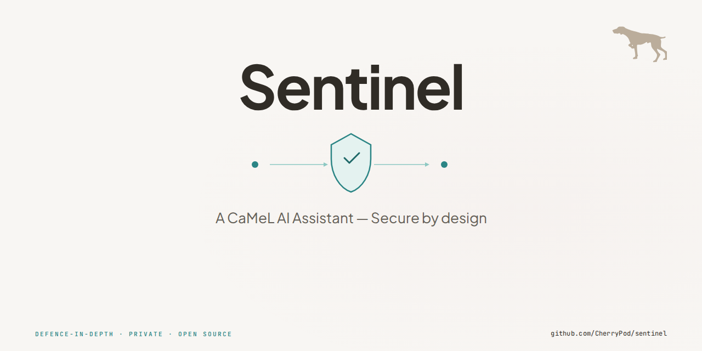
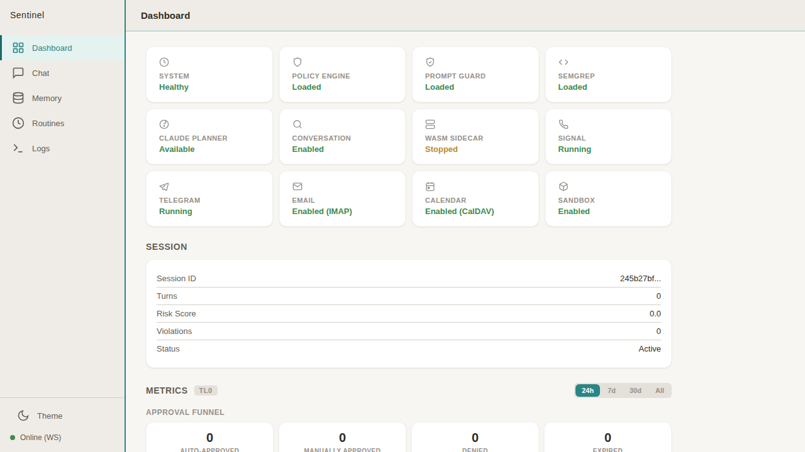
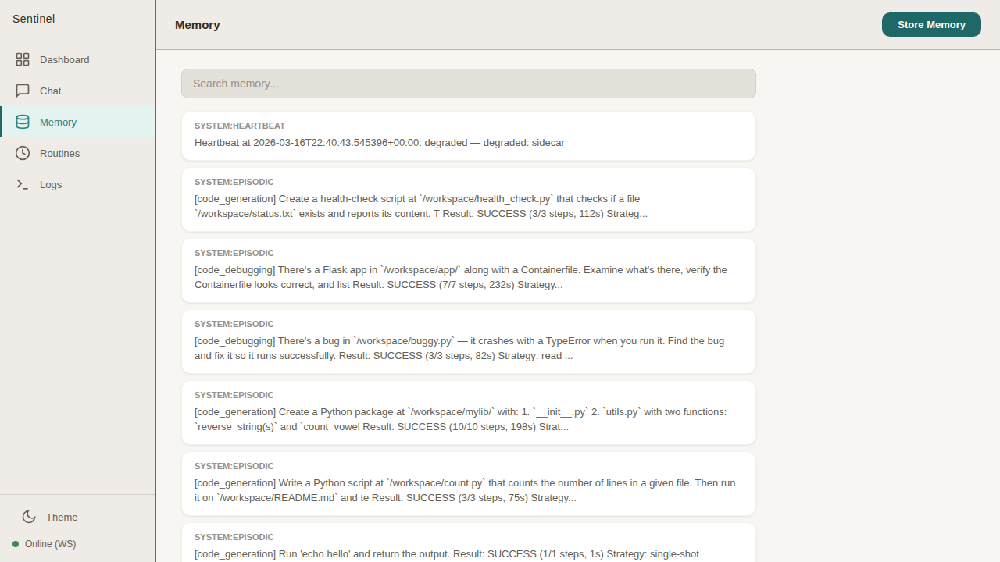
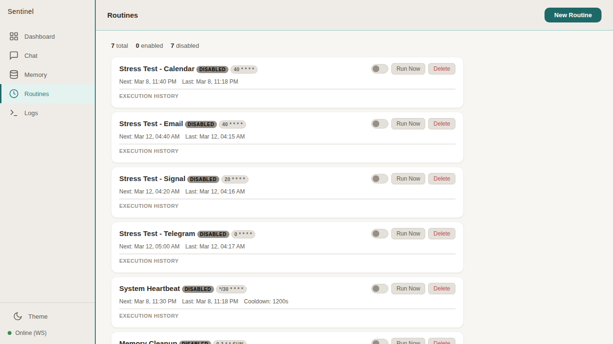
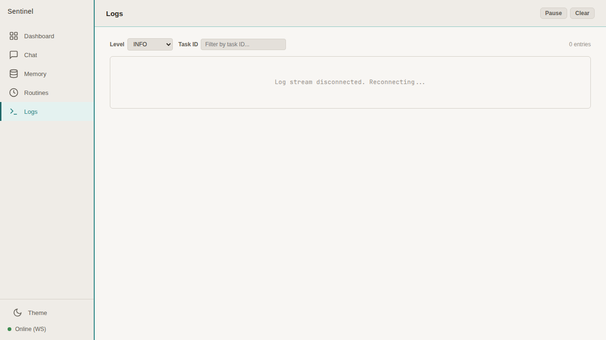

<p align="center">
  
</p>

# Sentinel

A defence-in-depth AI assistant built on the [CaMeL architecture](https://arxiv.org/abs/2503.18813). A frontier model (Claude) plans tasks, an air-gapped local LLM (Qwen) executes them, and a Python security gateway enforces 10 layers of scanning between every step. The worker LLM is assumed compromised at all times — it only receives text and returns text, and every output is scanned before the system acts on it.

## What Makes This Different

- **Air-gapped worker** — the local LLM has zero network access. It cannot phone home, exfiltrate data, or fetch remote payloads
- **10-layer security pipeline** — deterministic policy engine, spotlighting, Prompt Guard, Semgrep static analysis, command pattern scanner, encoding scanner, conversation analysis, vulnerability echo detection, ASCII prompt gate, and CaMeL provenance tracking
- **Tiered trust model** — the worker starts with zero trust (text in/out only). Capabilities unlock incrementally after red team passes at each level
- **Human approval gates** — every plan is shown to the user before execution. No autonomous action without consent
- **CaMeL provenance** — every data item is tagged with its source and trust level. Untrusted data cannot reach dangerous operations without scanning and approval

## Recent Additions

- **PostgreSQL migration** — full SQLite removal, 17 tables with row-level security and pgvector embeddings ([details](docs/features/postgresql-migration.md))
- **Contact registry & PII boundary** — opaque user IDs for planner, real identifiers only at edges ([details](docs/features/contact-registry.md))
- **Router & fast path** — local LLM classifies requests, 9 templates skip planner for simple tasks ([details](docs/features/router-fast-path.md))
- **Orchestrator refactor** — monolith split from 2,662 to 1,390 lines across 5 focused modules ([details](docs/features/orchestrator-refactor.md))
- **Episodic learning** — embedding-based long-term memory with hybrid retrieval and diversity filtering ([details](docs/features/episodic-learning.md))
- **Code fixer v2.5** — deterministic multi-language code fixer for worker output, 13 languages, 270+ tests ([details](docs/features/code-fixer.md))
- **Dynamic replanning** — discovery and failure-based replanning with independent budgets ([details](docs/features/dynamic-replanning.md))
- **Sandboxed execution** — disposable Podman containers, network-isolated, capability-dropped ([details](docs/features/sandboxed-execution.md))
- **Multi-channel access** — WebSocket, SSE, Signal, Telegram, Email, Calendar, MCP ([details](docs/features/multi-channel.md))
- **Routine scheduling** — cron, event, and interval triggers for autonomous tasks ([details](docs/features/routine-scheduling.md))

## Architecture

```
+-------------------------------------------------------------------+
|                    sentinel (Python/FastAPI)                       |
|                   HTTPS :8443 / HTTP :8080                        |
|                                                                   |
|  Static UI (/)  |  REST API (/api/*)  |  WebSocket (/ws)         |
|  SSE (/api/events)  |  MCP server (/mcp/)                        |
|                                                                   |
|  POST /task  -->  Router (classify)  -->  Fast path (9 templates) |
|              -->  OR: Claude plans    -->  Human approval          |
|              -->  Per-step execution:                              |
|                                                                   |
|     llm_task:  prompt gate -> Qwen -> Semgrep -> scan             |
|     tool_call: policy check -> execute -> tag provenance          |
|     shell:     sandbox container (disposable, air-gapped)         |
|                                                                   |
|  10 security layers  |  Policy engine    |  Provenance store      |
|  PostgreSQL 17       |  pgvector + RLS   |  Episodic memory       |
|  Contact registry    |  Event bus        |  Channel router        |
+-----------------------------+-------------------------------------+
                              | sentinel_internal (air-gapped)
+-----------------------------v-------------------------------------+
|              sentinel-ollama (Ollama, GPU)                         |
|                                                                   |
|     Qwen 3 14B Q4_K_M -- text in, text out (GPU)                 |
|     nomic-embed-text -- embeddings for memory search (CPU)        |
|     No internet  |  No tools  |  No file access                   |
+-------------------------------------------------------------------+
```

| Component | Role | Trust Level | Network |
|-----------|------|-------------|---------|
| Claude API (Anthropic) | Privileged planner | Trusted | Internet (via sentinel) |
| Qwen 3 14B (Ollama) | Quarantined worker | **Never trusted** | Air-gapped only |
| Sentinel (FastAPI) | Security gateway + UI + channels | Deterministic | Both networks |

## Security Model

Sentinel assumes the worker LLM is adversarial. Every output passes through a 10-layer scan pipeline before the system acts on it:

| # | Layer | Type | What It Catches |
|---|-------|------|-----------------|
| 1 | PIN Authentication | ASGI middleware | Unauthenticated API access |
| 2 | Policy Engine | Deterministic YAML | File paths, commands, credentials, network |
| 3 | Spotlighting | String manipulation | Prompt injection (dynamic markers, sandwich defence) |
| 4 | Prompt Guard 2 | 86M BERT classifier | Injection detection |
| 5 | Semgrep | Direct static analysis (101 rules) | Malicious code patterns, hardcoded secrets |
| 6 | CommandPatternScanner | Regex patterns | Dangerous shell patterns in prose |
| 7 | ConversationAnalyzer | Multi-turn heuristics | Memory poisoning, escalation, context building |
| 8 | VulnerabilityEchoScanner | Input/output fingerprinting | Code injection via "review this" framing |
| 9 | ASCII Prompt Gate | Regex allowlist | Cross-model bilingual injection |
| 10 | CaMeL Provenance | Data tagging | Untrusted data reaching dangerous operations |

## Test Results

### Functional (G-suite at Trust Level 4)

| Suite | Score | Notes |
|-------|-------|-------|
| G1: Build Capability | 11/13 (85%) | 2 failures = Qwen output quality (model ceiling) |
| G2: Debug & Dev | 14/18 (78%) | Category A: 12/12, B+C limited by multi-turn complexity |
| G3: E2E Workflows | 5/8 (63%) | 2 harness issues, 1 needs fixture |
| G4: Plan Quality | 14/15 (93%) | Complex 16-step plans completing in 500-940s |
| G5: Dependencies | 6/6 (100%) | Stable across all runs |

### Red Team (adversarial — zero breaches)

| Scenario | Result |
|----------|--------|
| B1: Adversarial User (12 campaigns) | **0 exploits** |
| B1.5: Adversarial Data (9 campaigns) | **0 exploits** |
| B2: Compromised Planner (16 categories) | **0 exploits** |
| B3: Perimeter (7 categories) | **0 failures** |
| B4: Sandbox Isolation (17 categories) | **90/90 blocked** |
| B5: Database (7 categories) | **0 exploits** |

Zero S0 (breach) or S1 (exploitable leak) across all scenarios and runs.

## Quick Start

### Prerequisites

- [Podman](https://podman.io/) (rootless) + podman-compose
- NVIDIA GPU with 12GB+ VRAM (for Qwen 3 14B)
- [NVIDIA Container Toolkit](https://docs.nvidia.com/datacenter/cloud-native/container-toolkit/latest/install-guide.html) with CDI configured
- Anthropic API key (for Claude planner)
- HuggingFace token (for Prompt Guard model download during build — [get one here](https://huggingface.co/settings/tokens))

### 1. Clone and create secrets

```bash
git clone https://github.com/CherryPod/sentinel.git
cd sentinel

# Create the secrets directory (gitignored)
mkdir -p secrets

# Required: Anthropic API key for the Claude planner
echo "sk-ant-your-key-here" > secrets/claude_api_key.txt
chmod 600 secrets/claude_api_key.txt
```

### 2. Optional: Set a PIN

PIN authentication is optional. Without a PIN file, the UI works with no authentication — fine for local development.

```bash
# Optional: set a 4-digit PIN to protect the UI
echo "1234" > secrets/sentinel_pin.txt
chmod 600 secrets/sentinel_pin.txt
```

### 3. Build the sentinel image

The build downloads the Prompt Guard model from HuggingFace, which requires an access token passed as a build secret.

```bash
# Store your HuggingFace token somewhere outside the repo
echo "hf_your-token-here" > /tmp/hf_token.txt

# Build (takes a few minutes — installs PyTorch, transformers, downloads Prompt Guard)
podman build \
  --secret id=hf_token,src=/tmp/hf_token.txt \
  -t sentinel \
  -f container/Containerfile .

# Tag with the compose name (podman-compose looks for this)
podman tag sentinel sentinel_sentinel

# Clean up the token
rm /tmp/hf_token.txt
```

### 4. Start the stack

```bash
podman compose up -d
```

This starts two containers:
- **sentinel** — the security gateway, API, and UI (ports 3001 HTTPS, 3002 HTTP)
- **sentinel-ollama** — air-gapped Ollama instance with GPU access

### 5. Download the Qwen model

On first run, the Ollama container has no models loaded. Pull Qwen 3 14B:

```bash
podman exec sentinel-ollama ollama pull qwen3:14b
```

This downloads ~8GB and takes a few minutes. The model is stored in a persistent volume, so you only need to do this once.

### 6. Open the UI

Go to **https://localhost:3001** in your browser.

- Accept the self-signed certificate warning (Advanced → Accept the Risk)
- If you set a PIN in step 2, you'll see a PIN prompt — enter it
- If you skipped the PIN, the UI loads directly
- Type a task and hit Send — Claude will plan it, you approve, Qwen executes

### Verify the stack

```bash
# Health check (should return JSON with all subsystems loaded)
curl -sk https://localhost:3001/health | python3 -m json.tool

# Full smoke test
bash scripts/smoke_test.sh
```

## Using the UI

- **Send a task** — type in the input box and press Enter or click Send
- **Approve/deny plans** — Claude's plan is shown with expandable step details. Click a step to see the full prompt that Qwen will receive. Approve or deny the plan
- **Clear history** — **Shift+click** the "Sentinel" title in the header to clear conversation history. History is stored in your browser's localStorage only — it never leaves your machine
- **Transport** — the UI automatically connects via WebSocket for real-time updates, falling back to HTTP polling if WebSocket isn't available

## Screenshots

<details>
<summary>Dashboard — system health, session info, metrics</summary>

</details>

<details>
<summary>Chat interface</summary>

</details>

<details>
<summary>Episodic memory browser</summary>

</details>

<details>
<summary>Routine scheduler</summary>

</details>

<details>
<summary>Log viewer</summary>

</details>

## Project Structure

```
sentinel/
├── README.md                   This file
├── LICENSE                     Apache-2.0
├── CONTRIBUTING.md             Contributor guide
├── SECURITY.md                 Vulnerability reporting
├── pyproject.toml              Python package config
├── podman-compose.yaml         2-container deployment
│
├── sentinel/                   Python package (security gateway + orchestrator)
│   ├── core/                   Config, database (PostgreSQL), event bus, models
│   ├── security/               Scanners, policy engine, pipeline, code fixer
│   ├── planner/                Claude planner, orchestrator, builders, intake, dispatch
│   ├── router/                 Fast-path classifier, templates, executor
│   ├── contacts/               Contact registry, PII boundary, resolver
│   ├── worker/                 Ollama/Qwen client, provider ABCs
│   ├── tools/                  Policy-checked tool executor, sandbox
│   ├── session/                Session + conversation tracking
│   ├── api/                    FastAPI app, auth, middleware
│   ├── audit/                  Structured JSON logging
│   ├── memory/                 Embeddings, episodic records, hybrid search
│   ├── channels/               WebSocket, SSE, MCP, Signal, Telegram, Email
│   └── routines/               Scheduled task engine (cron, event, interval)
│
├── tests/                      4,147+ Python tests
├── ui/                         Static chat UI (HTML/JS/CSS)
├── docs/features/              Feature documentation
│
├── container/                  Containerfile for builds
├── sidecar/                    Rust WASM tool sandbox (50 tests)
├── policies/                   Deterministic security rules (YAML)
└── rules/                      Semgrep rule definitions (101 rules)
```

## Running Tests

```bash
# Python tests (requires a virtualenv with dependencies)
python -m venv .venv
source .venv/bin/activate
pip install -e ".[dev,mcp]"
pytest tests/

# Or run inside the container (no local setup needed)
podman exec sentinel pytest /app/tests/

# Rust sidecar tests
cargo test --manifest-path sidecar/Cargo.toml
```

## Current Status

**v0.3.0** — Trust Level 4 active. Full defence-in-depth with zero red team breaches.

- 4,147+ Python tests + 50 Rust tests passing (4,197+ total)
- Zero red team breaches across 6 adversarial scenarios (B1–B5)
- PostgreSQL 17 with row-level security and pgvector embeddings
- Sandboxed shell execution via Podman API proxy (disposable containers, network-isolated)
- Multi-channel access: WebSocket, SSE, Signal, Telegram, Email, Calendar, MCP
- Router with 9 fast-path templates for simple tasks (skips planner, keeps security)
- Episodic learning with hybrid retrieval (FTS + vector + reranker + MMR)
- Code fixer v2.5 — deterministic output repair for 13 languages
- Dynamic replanning — discovery and failure-based, with independent budgets
- Plan-policy enforcement with allowed-command/allowed-path constraints per step
- Contact registry with opaque IDs (planner never sees PII)
- WASM tool sandbox (Rust sidecar with Wasmtime, capability model, leak detection)
- Routine scheduling engine (cron, event, interval triggers)
- Infrastructure hardened (TLS, CSP, CSRF, resource limits, read-only FS, pinned images, health checks)
- Direct Semgrep integration with 101 rules

## License

[Apache License 2.0](LICENSE)

## Credits

Built with [Claude](https://claude.ai) (Anthropic) as the trusted planner and [Qwen 3](https://huggingface.co/Qwen) (Alibaba) as the air-gapped worker. Security scanning by [Prompt Guard 2](https://huggingface.co/meta-llama/Prompt-Guard-2-86M) (Meta) and [Semgrep](https://semgrep.dev/) (r2c).
