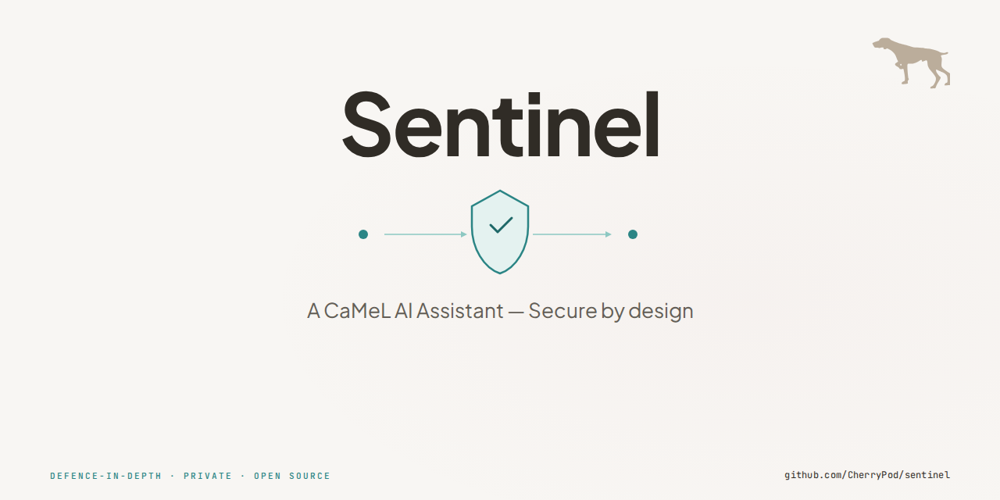
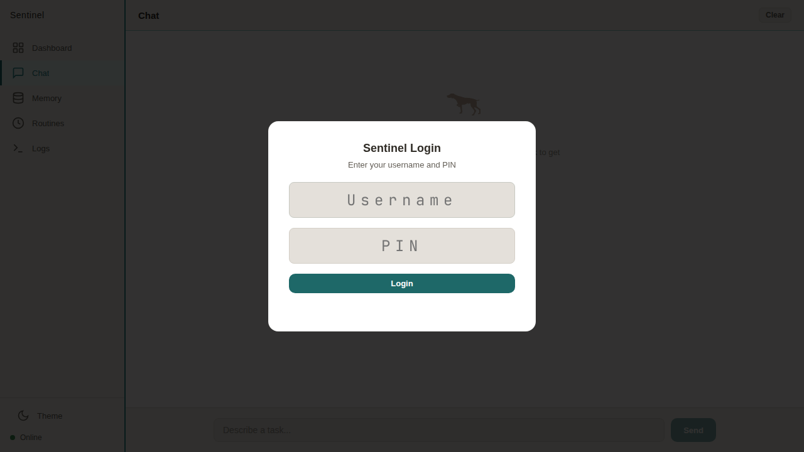
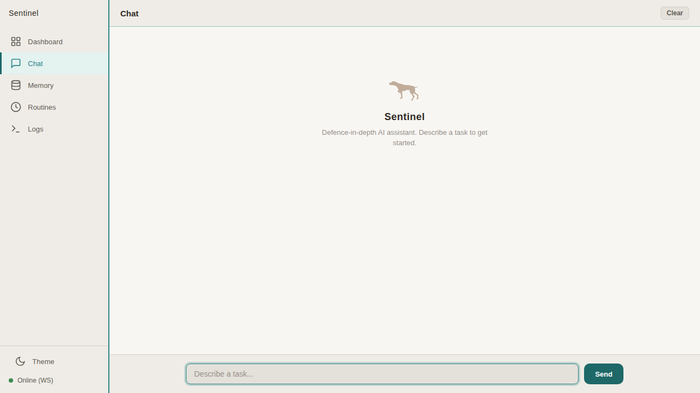
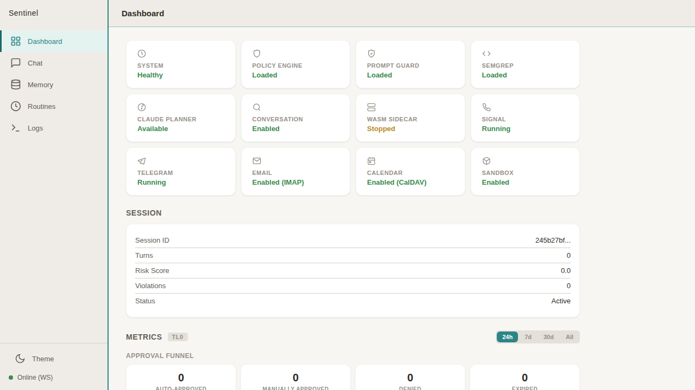
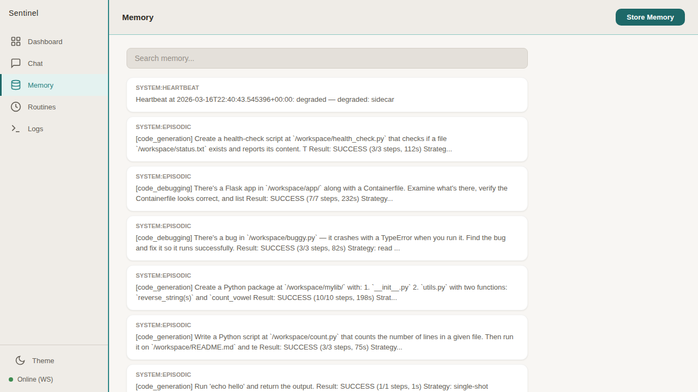
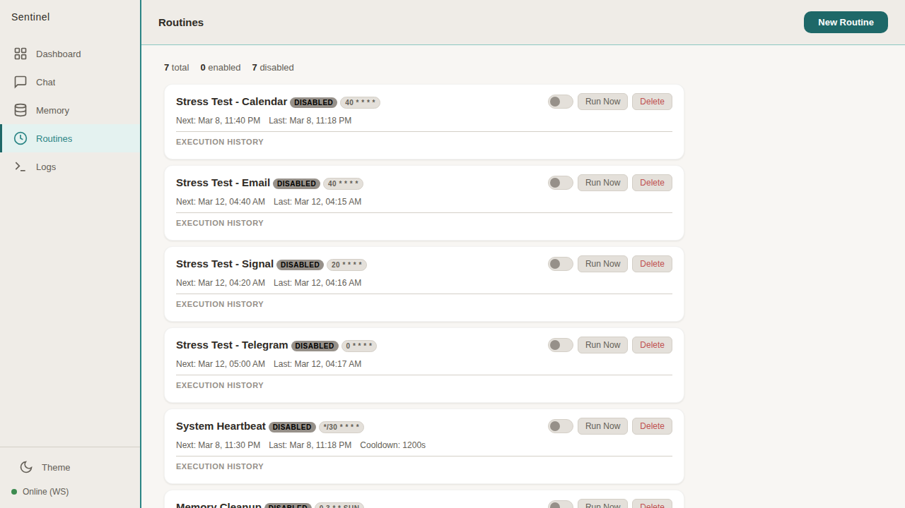

# Sentinel

A defence-in-depth AI assistant built on the [CaMeL architecture](https://arxiv.org/abs/2503.18813). A frontier model (Claude) plans tasks, an air-gapped local LLM (Qwen) executes them, and a Python security gateway enforces scanning and policy between every step. The worker is assumed compromised at all times. It only receives text and returns text, and every output is scanned before the system acts on it. The controller is the only internet-facing trust boundary.

Built with [Claude](https://claude.ai) (Anthropic) as the trusted planner and [Qwen 3](https://huggingface.co/Qwen) (Alibaba) as the air-gapped worker. Injection detection uses [Prompt Guard 2](https://huggingface.co/meta-llama/Prompt-Guard-2-86M) (Meta). Code scanning uses [Semgrep](https://semgrep.dev/).



## Why this architecture

Most agent setups treat model output as the product. Sentinel treats the worker as an untrusted component. Plans need a person to approve them. Tool calls run in a disposable container with no network. Data is tagged with where it came from, and untrusted data cannot reach a dangerous operation without a scan and a policy check.

- **Air-gapped worker.** `sentinel-ollama` sits only on `sentinel_internal`, created with `--internal --disable-dns`, so it has no external route and no DNS resolver.
- **Authenticated control plane.** Username and PIN login issues an HttpOnly JWT session cookie. API routes require that session.
- **Fail-closed tool sandbox.** Shell tools run in disposable containers behind an allowlisted Podman API proxy. Anything not allowlisted is rejected.
- **Human approval.** Every plan is shown before execution.
- **Provenance.** Every data item carries its source and trust level.

## Architecture

```
+-----------------------------------------------------------------+
|                    sentinel (Python/FastAPI)                     |
|         HTTPS :8443 / HTTP :8080 (host 3001 / 3002)            |
|         networks: sentinel_internal + sentinel_egress           |
|                                                                 |
|  Static UI (/)  |  REST API (/api/*)  |  WebSocket (/ws)       |
|  SSE (/api/events)  |  MCP server (/mcp/)                      |
|                                                                 |
|  Auth gate (JWT session) --> task intake --> scan / plan        |
|              --> Human approval    -->  Per-step execution:     |
|                                                                 |
|     llm_task:  prompt gate -> Qwen -> scan                      |
|     tool_call: policy check -> Podman proxy -> sandbox          |
+-----------------------------+-----------------------------------+
                              | sentinel_internal
                              | (--internal --disable-dns)
+-----------------------------v-----------------------------------+
|              sentinel-ollama (Ollama, GPU)                       |
|     Qwen 3 14B -- text in, text out                              |
|     nomic-embed-text -- embeddings (CPU)                         |
|     No internet  |  No DNS  |  No tools  |  No file access      |
+-----------------------------------------------------------------+
```

| Component | Role | Trust | Network |
|-----------|------|-------|---------|
| Claude API | Privileged planner | Trusted | Internet, via sentinel egress |
| Qwen 3 14B | Quarantined worker | Never trusted | `sentinel_internal` only |
| Sentinel | Gateway, UI, channels | Deterministic | Internal and egress |
| Sandbox containers | Disposable tool execution | Untrusted | `network=none`, via the Podman proxy |

## Security model

Login sits in front of the scan pipeline. `POST /api/auth/login` sets an HttpOnly `session` cookie. Unauthenticated API calls get 401, except a short exempt list: login, logout, health, HMAC-signed webhooks, and the MCP endpoint (bearer token).

Worker and tool outputs still pass the scan and policy pipeline:

| # | Layer | What it catches |
|---|-------|-----------------|
| 1 | Policy engine | File paths, commands, credentials, network |
| 2 | Spotlighting | Prompt injection, with dynamic markers |
| 3 | Prompt Guard 2 | Injection classification |
| 4 | Semgrep | Malicious code patterns |
| 5 | Command pattern scanner | Dangerous shell patterns in prose |
| 6 | Conversation analyser | Multi-turn escalation and context building |
| 7 | Vulnerability echo scanner | "Review this code" injection |
| 8 | ASCII prompt gate | Cross-model bilingual injection |
| 9 | CaMeL provenance | Untrusted data reaching dangerous operations |

## Screenshots







## What is in this repository

This tree is the gateway, the UI, the Rust sidecar, the policies, and the docs below.

| Document | What it covers |
|----------|----------------|
| [Codebase map](docs/codebase-map.md) | Module map |
| [Changelog](docs/CHANGELOG.md) | What changed, and why |
| [Sandboxed execution](docs/features/sandboxed-execution.md) | Disposable Podman sandboxes |
| [Multi-channel](docs/features/multi-channel.md) | WebSocket, SSE, MCP, and messaging channels |
| [Contact registry](docs/features/contact-registry.md) | Opaque ids so the planner never sees real addresses |
| [Episodic learning](docs/features/episodic-learning.md) | Outcome memory for later plans |
| [Dynamic replanning](docs/features/dynamic-replanning.md) | Recovery when a step fails |
| [Routine scheduling](docs/features/routine-scheduling.md) | Cron, interval, and event triggers |
| [PostgreSQL](docs/features/postgresql-migration.md) | Row-level security and role separation |
| [Code fixer](docs/features/code-fixer.md) | Deterministic repair of worker code output |
| [Router fast path](docs/features/router-fast-path.md) | Simple requests that skip the planner |

## Quick start

### Prerequisites

- [Podman](https://podman.io/) (rootless) and podman-compose
- An NVIDIA GPU with 12GB or more of VRAM, for Qwen 3 14B
- The [NVIDIA Container Toolkit](https://docs.nvidia.com/datacenter/cloud-native/container-toolkit/latest/install-guide.html) with CDI configured
- An Anthropic API key for the planner
- A HuggingFace token, used only at image build time to download Prompt Guard

### 1. Clone and create secrets

Compose refuses to start if a declared secret file is missing. Create the files you use, and delete or retarget the unused `secrets:` entries in `podman-compose.yaml` before `podman compose up`.

```bash
git clone https://github.com/CherryPod/sentinel.git
cd sentinel

mkdir -p secrets
chmod 700 secrets

echo "sk-ant-your-key-here" > secrets/claude_api_key.txt
echo "1234" > secrets/sentinel_pin.txt
openssl rand -hex 32 > secrets/session_key.txt
openssl rand -hex 32 > secrets/credential_key.txt
chmod 600 secrets/*.txt
```

`SENTINEL_REQUIRE_SECRETS=true` fail-closes without the session key, the PIN, and the credential key.

### 2. Build the images

```bash
echo "hf_your-token-here" > /tmp/hf_token.txt

podman build \
  --secret id=hf_token,src=/tmp/hf_token.txt \
  -t sentinel \
  -f container/Containerfile .

podman tag sentinel sentinel_sentinel
podman build -t sentinel-sandbox:latest -f container/Containerfile.sandbox .
rm /tmp/hf_token.txt
```

The controller refuses to start without `sentinel-sandbox:latest`.

### 3. Start the stack

Create the air-gapped network once. Compose marks `sentinel_internal` as external so Podman keeps `--disable-dns` across restarts.

```bash
podman network create --internal --disable-dns --subnet 172.30.0.0/24 sentinel_internal
podman compose up -d
```

That starts two containers:

- **sentinel** on `sentinel_internal` and `sentinel_egress` (host ports 3001 HTTPS, 3002 HTTP)
- **sentinel-ollama** on `sentinel_internal` only

Channel tokens (search, messaging, calendar, weather) are further `secrets:` entries in the compose file. Leave those channels disabled, or point each entry at a file you create, before the first `up`.

### 4. Download the worker model

```bash
podman exec sentinel-ollama ollama pull qwen3:14b
```

The weights land in a volume. You only pull them once.

### 5. Open the UI

Go to **https://localhost:3001**. Accept the self-signed certificate. Sign in as **Admin** (the default `SENTINEL_BOOTSTRAP_USERNAME`) with the PIN from `secrets/sentinel_pin.txt`.

### Check the running stack

```bash
curl -sk https://localhost:3001/health | python3 -m json.tool
curl -sk https://localhost:3001/api/health | python3 -m json.tool
bash scripts/smoke_test.sh
```

## Current status

`main` is the gateway as it runs today: username and PIN sessions, an air-gapped worker, approval gates, and disposable sandboxes. See the [changelog](docs/CHANGELOG.md) for the history.

## License

[Apache License 2.0](LICENSE)
